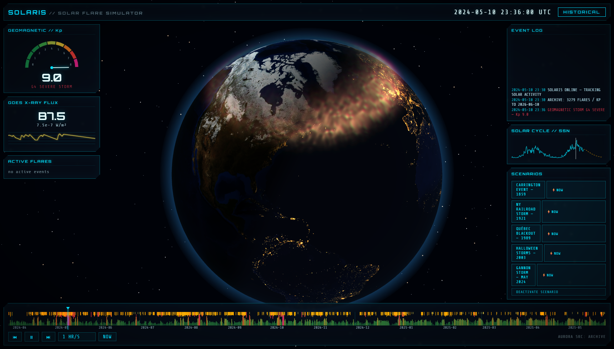

# SOLARIS — Solar Flare Simulator

A sci-fi space-weather console: a 3D Earth with auroras rendered in real time above it,
driven by **real historical data (2010 → today)**, **live NOAA feeds**, official forecasts,
and a deterministic synthetic far-future — plus replayable **legendary storm scenarios**
(Carrington 1859, the 1921 Railroad Storm, Québec 1989, Halloween 2003, Gannon 2024),
each of which can also be launched as a *"what if it struck right now"* simulation.

Live at **https://solaris.gsection.com**



## What it shows

- **3D globe** with day/night terminator computed from the simulated time, NASA Blue Marble +
  city-lights textures, atmospheric rim glow, starfield.
- **Auroras** as a stack of 12 instanced additive shader shells: a parametric auroral oval in
  *magnetic* coordinates whose equatorward boundary, width, intensity and colour follow the Kp
  index (green 557.7 nm base climbing to red/purple, storm-red takeover above Kp 5, diffuse
  mid-latitude "blood-red skies" for Carrington-class events). Within ±45 min of wall-clock now
  it switches to the **real NOAA OVATION model grid**.
- **Timeline** scrubber with per-pixel Kp heat-strip and flare tick marks (C/M/X), wheel-zoom
  from 170 years down to hours, drag to scrub, play/pause at speeds from real-time to a week
  per second.
- **HUD**: Kp gauge with G-scale storm labels, GOES X-ray flux readout + 6 h trace
  (live data near now, synthesized from flare records elsewhere), active flare list, event log,
  solar-cycle sparkline (observed + predicted SSN), scenario launcher.

## Data sources

| Layer | Source | Access |
|---|---|---|
| Kp 2010→snapshot | GFZ Potsdam definitive + nowcast | baked by `scripts/fetch-archive.mjs` |
| Solar flares 2010→snapshot | NASA DONKI FLR | baked (6-month chunks, resume cache) |
| Solar cycle SSN obs + prediction | NOAA SWPC | baked |
| Kp/flares snapshot→now | GFZ / DONKI | `/api/*` server proxy, 3 h disk cache |
| Live Kp (1-min), GOES X-ray, OVATION aurora grid | NOAA SWPC | direct browser fetch (CORS-enabled) |
| 3-day geomag forecast, 27-day outlook | NOAA SWPC text products | direct fetch, `/api/swpc-proxy` fallback |
| Beyond +27 days | deterministic synthetic generator seeded per 27-day solar rotation, rates scaled by predicted SSN | client-side |

Scenario time-series are hand-authored from literature estimates (Dst, reconstructed boundary
latitudes). Synthetic and scenario data are always badged **SIMULATION** in the UI.

## URL parameters

- `?t=2024-05-10T23:00:00Z` — start at a moment in time (try the Gannon storm!)
- `?scenario=carrington-1859` — arm a scenario at its historical date (`&now=1` anchors it at now).
  IDs: `carrington-1859`, `railroad-1921`, `quebec-1989`, `halloween-2003`, `gannon-2024`
- `?cam=lat,lon,distance` — initial camera, e.g. `?cam=78,-60,3.2`
- `?kp=7` — force a Kp value (visual testing)
- `?dev=1` — aurora tuning panel

## Development

```bash
npm install
npm run fetch-archive   # refresh baked data (DONKI + GFZ + solar cycle)
npm run fetch-textures  # one-time NASA texture download
npm run dev             # Vite dev server (proxies /api to :8080)
npm run build           # type-check + production bundle
npm run serve           # production server on :8080 (static + /api proxy-cache)
```

The production server (`server/index.mjs`) is dependency-free Node 24: it serves `dist/` and
caches the GFZ/DONKI gap-extension queries on disk (`server/cache/`), serving stale data if
upstreams are down.

## Deployment

Docker (see `Dockerfile` + `deploy/docker-compose.yml`): two-stage node:24-alpine build,
container `solaris-app` on the external `web` network behind the Caddy gateway at
`solaris.gsection.com`. Deployed with the standard `deploy.ps1 solaris` flow.
